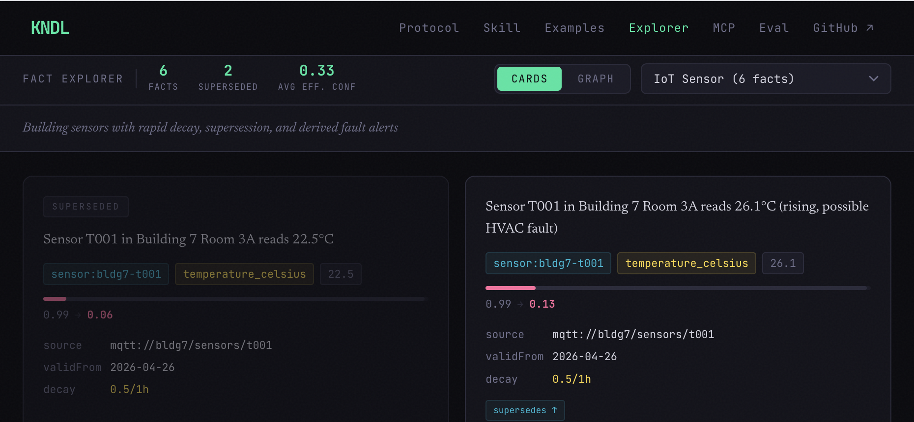

<div align="center">



# KNDL — Knowledge Node Data Link

**The format Anthropic Memory was waiting for**

[](https://github.com/artdaw/KNDL/actions/workflows/kndl-workflow.yml)
[](LICENSE)
[](packages/kndl-memory)
[](https://kndl.artdaw.com)

</div>

---

Anthropic just shipped Memory for agents — a filesystem.
But filesystems are dumb about confidence, time, and source.
Agents fill them with markdown that **can't be queried, won't decay, and loses provenance the moment it's written.**

**KNDL is the format that makes Memory actually smart.**

```
Anthropic Memory  =  WHERE   filesystem, persistence, permissions
KNDL              =  WHAT    the format of files Claude writes
kndl-mcp / CLI    =  HOW     query, decay, contradiction detection, provenance
```

---

## Get started in 60 seconds

```bash
git clone https://github.com/artdaw/kndl
cd kndl/packages/kndl-memory
pnpm install && pnpm build
```

Add to **Claude Desktop** (`~/Library/Application Support/Claude/claude_desktop_config.json`):

```json
{
  "mcpServers": {
    "kndl": {
      "command": "node",
      "args": ["/path/to/kndl/packages/kndl-memory/dist/server.js"],
      "env": { "KNDL_STORAGE": "sqlite:///Users/you/.kndl/memory.db" }
    }
  }
}
```

Restart Claude Desktop. Now ask: *"Remember that Alice is a staff engineer with confidence 0.95."*

Claude writes a `.fact.json` file. Next session, it reads it back — with the confidence level, provenance, and decay exactly as you wrote them.

---

## Why not just markdown?

| | Markdown | **KNDL** |
|---|:---:|:---:|
| Know when a fact went stale | ✗ | ✅ decay + `effective_confidence` |
| Surface contradictions between sources | ✗ | ✅ ranked by recency + confidence |
| Trace a claim to its origin | ✗ | ✅ `source` URI + `derivedFrom` chain |
| Time-travel ("what did we believe last week?") | ✗ | ✅ `as_of` bitemporal query |
| Open-world negation ("no known allergy") | ✗ | ✅ `negated: true` |
| PHI / PII sensitivity gating | ✗ | ✅ `classification` filtered by default |

---

## The fact shape

One immutable file per assertion. Every fact is a JSON-LD document:

```json
{
  "@context": "https://kndl.artdaw.com/context/v1.jsonld",
  "@id":       "fact:alice-role-20260426t100000z-ab12cd34",
  "@type":     "Fact",

  "statement":  "Alice is a staff engineer on the payments team",
  "subject":    "person:alice",
  "predicate":  "role",
  "object":     "staff engineer, payments",

  "confidence": 0.95,
  "decay":      "0.5/180d",

  "source":     "human://gleb",
  "validFrom":  "2026-04-26T10:00:00Z",
  "recordedAt": "2026-04-26T10:00:00Z"
}
```

`decay: "0.5/180d"` — confidence halves every 180 days.
Effective confidence at query time: `confidence × rate ^ (elapsed / window)`.

**Facts are immutable.** Updates create a new fact with `supersedes` pointing at the old one.
History is preserved for time-travel; only the latest is shown in active queries.

---

## MCP tools (11)

| Tool | What it does |
|------|-------------|
| `assert_fact` | Write a new immutable fact |
| `query_facts` | Read active facts with decay-adjusted confidence at `as_of` |
| `contradictions` | Find conflicting facts, ranked by recency + confidence |
| `supersede_fact` | Replace a fact — old version preserved for time-travel |
| `as_of` | Bitemporal query: what did memory believe at timestamp X? |
| `provenance_chain` | Walk `derivedFrom` + `supersedes` backward to the source |
| `subscribe` | Get notified when a fact changes |
| `unsubscribe` | Cancel a subscription |
| `list_subscriptions` | List active subscriptions |
| `sync_memory_store` | Pull from an Anthropic Memory Store (needs `ANTHROPIC_API_KEY`) |
| `list_memory_stores` | List configured remote stores + last-sync timestamps |

---

## Storage

Set `KNDL_STORAGE` to choose where facts live:

| URL | Backend | Use case |
|-----|---------|----------|
| `fs:/memory` | Filesystem (one `.fact.json` per fact) | **Anthropic Memory mount** |
| `sqlite:./kndl.db` | SQLite, WAL mode | **Claude Desktop standalone** ← default |
| `duckdb:./kndl.duckdb` | DuckDB columnar | Analytical workloads |
| `supabase:<url>?key=<anon>` | Supabase + RLS | Multi-tenant cloud |

---

## Use with Anthropic Memory (Skill)

Copy the Skill bundle into your agent's skills directory:

```bash
# Drop into your Anthropic Memory store
cp -r skills/kndl-memory/SKILL.md   /memory/skills/
cp -r skills/kndl-memory/context/   /memory/context/
```

Claude then automatically writes structured facts instead of markdown, queries them with decay applied, and surfaces contradictions before answering.

---

## CLI reference

```bash
export KNDL_STORAGE=fs:./memory   # or sqlite:, duckdb:, supabase:

# Write a fact
kndl add \
  --statement "Alice is a staff engineer, payments" \
  --subject person:alice --predicate role \
  --confidence 0.95 --source "human://gleb" \
  --decay "0.5/180d" --valid-from now

# Query active facts (decay applied)
kndl query --subject person:alice

# Find contradictions
kndl contradict --subject person:alice --predicate role

# Time-travel
kndl as-of 2026-01-01T00:00:00Z --subject person:alice

# Audit trail
kndl provenance --id fact:alice-role-...

# Sync from Anthropic Memory Store
kndl remote add --provider anthropic --store-id store_abc --label personal
kndl remote pull personal
```

---

## HTTP server (multi-agent / Goose)

Run one server for shared memory across Claude Desktop + Goose + LM Studio:

```bash
KNDL_STORAGE=sqlite:./shared.db \
  node packages/kndl-memory/dist/server.js --http
# → http://localhost:8000/mcp
```

**Goose** (`~/.config/goose/config.yaml`):
```yaml
extensions:
  kndl:
    type: streamable_http
    url: http://localhost:8000/mcp
```

**LM Studio** (`~/.lmstudio/mcp.json`):
```json
{ "mcpServers": { "kndl": { "type": "http", "url": "http://localhost:8000/mcp" } } }
```

---

## Repository

```
packages/kndl-memory/     @kndl/memory — TypeScript library + MCP server + CLI
  src/
    core.ts               decay math, fact construction, shared query algorithms
    types.ts              Fact, FactInput, FactStore interface
    stores/               fs · sqlite · duckdb · supabase backends
    remote/               Anthropic Memory Store sync
    server.ts             kndl-memory-mcp MCP server (stdio + HTTP)
    cli.ts                kndl CLI
  eval/runner.ts          eval runner — 33 questions, Claude-as-judge
  tests/                  36 passing tests

skills/kndl-memory/       Claude Skill bundle (drop into /memory/skills/)
  SKILL.md                conventions Claude follows
  context/v1.jsonld        JSON-LD @context
  examples/               8 domain bundles · 42 facts

website/                  docs — kndl.artdaw.com (React + Vite)
```

---

## Eval

KNDL must beat vanilla (facts pasted in system prompt) on ≥ 70% of 33 questions to ship.

```bash
export ANTHROPIC_API_KEY=sk-ant-...
make publish-eval   # runs eval → writes results → builds website
```

---

## License

MIT — [kndl.artdaw.com](https://kndl.artdaw.com)
